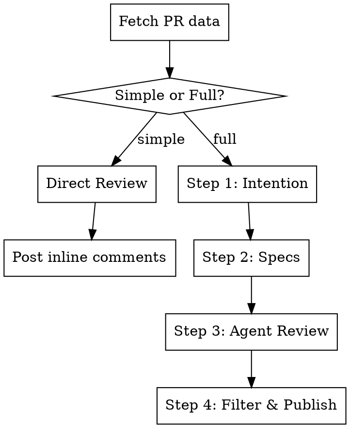

# PR Review

## Overview

Automated PR review that posts **inline comments at the exact code lines** — never in global comments (except for 3 structured summaries). Runs in a GitHub Action, fully autonomous.

**Core principle:** Understand the developer's intent before judging their code.

## Inputs

- `repo` — owner/repo (from GitHub Action context or current repo)
- `pr_number` — PR number (from GitHub Action context or argument)

Everything else is auto-detected via `gh api`.

## Execution Context

Detect automatically via environment:

| Context | Detection | Step 4 behavior |
|---------|-----------|-----------------|
| **Remote** (GitHub Action) | `GITHUB_ACTIONS` env var is set | Full auto — classify and publish all findings without human input |
| **Local** (developer machine) | `GITHUB_ACTIONS` not set | Interactive triage — present findings one by one, user decides |

Steps 1-3 are identical in both contexts. Only Step 4 changes.

## Review Mode

After fetching PR data, **judge the complexity yourself** and choose the appropriate mode. Don't rely on rigid thresholds — use your judgement based on the nature of the changes, not just line counts.

| Mode | When to use | What happens |
|------|-------------|--------------|
| **Simple** | Small, focused PRs — bug fix, minor feature, config change, straightforward refactor | Direct review by you, no sub-agents, no Specs step. Fast and lean. |
| **Full** | Large PRs, multi-file refactors, new features with business logic, architectural changes | All steps, all agents. |

### Simple Mode

Skip Steps 1, 2, 3. Go straight from Step 0 (Fetch) to reviewing the code yourself.

**Mindset:** Think like a senior dev doing a quick but thorough review. Focus on:
- **Quality** — Is this code correct, readable, well-structured?
- **Integration** — Does this fit well in the existing codebase? Naming conventions, patterns, architecture?
- **Systemic thinking** — Is the problem bigger than this PR? Is the dev patching a symptom instead of fixing the root cause? Would a different approach prevent this class of bugs entirely?

**Output:** Post inline comments directly (same format as Step 4). Post one global summary comment with your overall assessment. No Intention/Specs/Elements filtres comments.

### Full Mode

All steps (0-4) as described below.

## Flow



## Step 0 — Fetch PR Data

Fetch everything needed upfront:

```bash
# PR metadata (title, description, branch, base)
gh api repos/{owner}/{repo}/pulls/{pr_number}

# Changed files with diff
gh api repos/{owner}/{repo}/pulls/{pr_number}/files

# Individual file contents at PR head (for full context)
gh api repos/{owner}/{repo}/contents/{path}?ref={head_sha}
```

Build a mental model of the PR: which files changed, how they relate, what's the scope.

## Step 1 — Intention

**Goal:** Understand the developer's psyche. Why are they writing this code? What problem are they solving? What's the underlying motivation?

Don't describe the diff. Understand the human behind it.

Analyze:
- Commit messages (tone, progression, what they reveal about the dev's thought process)
- PR title and description
- The nature of the changes (refactor? panic fix? new feature? exploration?)
- Patterns in the code that reveal intent (comments, variable names, TODOs)

**Output:** Post global comment `## Intention` — a short narrative of what the dev is trying to achieve and why.

**IMPORTANT:** This is posted via `gh api` as a PR comment. See `references/gh-api-comments.md`.

## Step 2 — Specifications

**Goal:** Identify what the PR *should* do, then compare with what it *actually* does.

### Linear Detection

Scan for a Linear ticket ID (regex `[A-Z]+-\d+`) in this order:
1. Branch name
2. PR title
3. PR description

If found, fetch the ticket via the **Linear MCP server** (use available MCP tools for Linear). The MCP provides direct access to issue details, description, labels, assignee, and project context.

### Spec Comparison

**With Linear ticket:**

Compare the ticket requirements against the actual diff. Post global comment:

```markdown
## Specifications

### Source: TSC-123 — "Ticket title"

**Couvert par la PR :**
- [requirement satisfied]

**Manquant dans la PR :**
- [requirement from ticket not implemented]

**Ajouts hors spec :**
- [changes not mentioned in ticket — flag if concerning or note if pertinent]
```

**Without Linear ticket:**

Deduce specs from commit messages, code structure, and diff. Post global comment with the deduced specs only (no diff comparison).

### User Path Analysis

After identifying the specs, analyze the PR for **blocking or unhandled user paths**. This is functional analysis, not code review.

Look for:
- Contradictions between permissions/routes/UI (e.g., a route allows access but a permission check blocks it)
- Missing error states on user-facing flows (expired token, network failure, empty states)
- Removed routes/pages without redirects (broken bookmarks, old email links)
- Edge cases in business logic (self-action, last admin, quota boundary)
- Inconsistencies between UI elements (stats showing global counts vs filtered table)

If blocking paths are found, include them in the Specifications comment under a dedicated section:

```markdown
**Chemins utilisateur a verifier :**
- [path description + impact + what to check]
```

## Step 3 — Expert Agent Review

**Goal:** Dispatch a team of specialized agents to review the code in parallel. Two types of agents work in complement.

### Expertise Agents (always present)

Review the entire diff through a specific technical lens:

| Agent | Focus |
|-------|-------|
| Architecture | Separation of concerns, coupling, dependencies, module boundaries |
| Performance | Complexity, unnecessary allocations, N+1 patterns, caching |
| Error Management | Missing error handling, silent failures, error propagation, recovery |

### Zone Agents (always present, PR-dependent)

Partition the changed files into **functional zones** (e.g., "Auth flows", "Licenses UI", "Data layer", "Dialogs & Forms"). Each zone agent gets deep context on its area — all related files, their interactions, and the data flow between them.

Zone agents catch bugs that expertise agents miss because they understand the full context of a feature area rather than scanning the whole diff through a narrow lens.

**How to partition:** Group files by feature or functional area, not by file type. A zone like "Auth flows" includes the page component, the auth context, the hooks, and the types — everything needed to understand the flow end-to-end.

### Dynamic Expertise Agents (minimum 2, no upper limit)

Based on the PR content, recruit additional expertise agents. The AI selects them based on what's in the diff.

Examples:
- **Security** — if auth, crypto, user input, SQL, or API keys are involved
- **Database** — if migrations, queries, or schema changes
- **Frontend** — if UI components, state management, or rendering
- **Testing** — if test files are modified or test coverage is impacted
- **API Design** — if endpoints, contracts, or public interfaces change
- **Concurrency** — if async patterns, locks, or race conditions are possible
- **Domain Expert** — if business logic specific to the project domain

### Agent Output

**Each agent reviews independently and returns a list of findings** with:
- The file and line number
- The concern
- The severity they suggest

See `references/agent-pool.md` for agent prompting guidelines.

## Step 4 — Filter, Classify & Publish

**Goal:** Review every agent finding, classify it, and publish only what matters — inline.

This step behaves differently depending on the execution context (see **Execution Context** above).

### Verification Gate

**Before classifying any finding, verify it is real.** Agents can produce false positives — especially when they infer behavior from naming conventions without reading the actual implementation.

For each finding flagged as Critical or Important by an agent:
1. Read the actual source code at the referenced line (not just the diff)
2. Check if the concern is already handled elsewhere (a guard clause upstream, a wrapper, a shared utility)
3. If uncertain, trace the data flow to confirm the issue exists

A finding that doesn't survive verification is downgraded to Futile.

### Classification

For each **verified** agent finding, the AI evaluates: *Is this real, important, and actionable?*

| Level | Emoji | Criteria | Action |
|-------|-------|----------|--------|
| Critical | `!` | Bug, security flaw, data loss, crash | Inline comment |
| Important | `!` | Incorrect logic, unhandled edge case, real risk | Inline comment |
| Best Practice | `i` | Works but could be better structured/maintained | Inline comment |
| Question | `?` | Ambiguity, unclear intent, needs dev input | Inline comment |
| Futile | — | Nitpick, style preference, no real impact | Filtered out |

See `references/classification-grid.md` for detailed examples.

### Remote Mode (GitHub Action) — Auto Publish

All verified findings are classified by the AI and posted automatically. No human in the loop.

### Local Mode — Interactive Triage

Present findings **one by one** to the user, grouped by severity (Critical first, then Important, Best Practice, Question).

For each finding, show:

```
[1/12] **Important** — *Agent: Error Management*
📄 src/api/client.ts:42

Missing error handling on the retry loop — if all retries fail,
the error is silently swallowed and undefined is returned.

→ Post this comment? (y/n/edit/skip all)
```

User responses:
- **y** — post the inline comment as-is
- **n** — skip, add to filtered elements
- **edit** — user rewrites the comment, then post
- **skip all** — skip remaining findings of this severity level

This lets the dev curate the review before it hits GitHub — avoiding noise and false positives the verification gate missed.

### Inline Comment Format

Every inline comment follows this structure:

```
**[Critical | Important | Best Practice | Question]** — *Agent: {agent_name}*

{Argumentation concise — 2-4 lines max. No full fix, just explain the issue.}

[For Best Practice only:]
> Concept: {principle name} — {1-line explanation}

[Optional code illustration — NOT the full fix:]
```suggestion
// show the pattern, not the solution
```
```

**CRITICAL:** Comments are posted as PR review comments on the exact line, NOT as global PR comments. See `references/gh-api-comments.md` for the API calls.

### Filtered Elements

Post a third global comment listing what was filtered:

```markdown
## Elements filtres

{count} observations jugees non significatives par les agents:

- **{file}:{line}** — {agent}: {one-line summary of what was filtered and why}
- ...
```

This provides transparency without polluting the code review.

### Positive Feedback

Post a section in the Specifications global comment highlighting what's well done:

```markdown
## Ce qui est bien fait

- [pattern or decision] — [why it's good]
- ...
```

This reinforces good practices and shows the review is balanced, not just a list of complaints. Only mention things that are genuinely well done — not obvious defaults.

### Publishing Order

1. Global comment: **Intention** (Step 1)
2. Global comment: **Specifications** (with specs, user paths, and positive feedback — Step 2)
3. All inline comments (Step 4 — classified findings)
4. Global comment: **Elements filtres** (Step 4 — filtered items)

## Common Mistakes

- **Posting findings as global comments** — Every code finding MUST be inline at the exact line
- **Giving the full fix in comments** — Explain the problem and illustrate, don't write the solution
- **Skipping the intention step** — Without understanding intent, you'll flag things that are intentional
- **Rating everything as Critical** — Be honest about severity. Most findings are Best Practice or Question
- **Ignoring Linear context** — If a ticket exists, missing requirements are more valuable than code nitpicks
