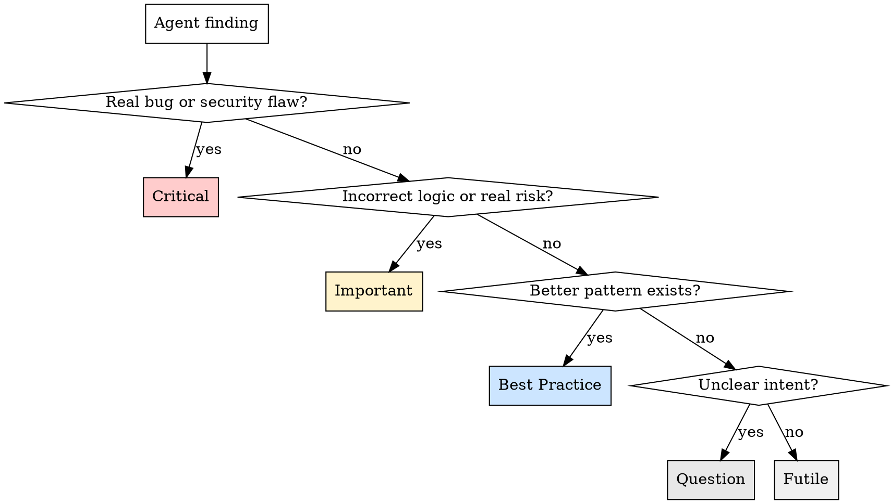

# Classification Grid — PR Review

## Decision Process

For each agent finding, ask these questions in order:



## Levels with Examples

### Critical

**Criteria:** Will cause a bug, security vulnerability, data loss, or crash in production.

**Examples:**
- SQL injection via string concatenation with user input
- Missing auth check on a protected endpoint
- Race condition that can corrupt shared state
- Off-by-one error that skips the last item in a dataset
- Unclosed database connection in an error path (connection leak)

**Comment tone:** Direct, factual, no sugarcoating. Explain what breaks and under what conditions.

### Important

**Criteria:** Logic is incorrect or an edge case with real probability will cause unexpected behavior. Not an immediate crash, but a real risk.

**Examples:**
- Null check missing on an API response that can legitimately return null
- Retry logic without backoff that could hammer a failing service
- Date comparison that ignores timezones in a multi-timezone app
- Array index used without bounds check on user-controlled input
- Error swallowed and replaced with a default value, hiding the root cause

**Comment tone:** Explain the scenario where this fails. "When X happens, this will Y because Z."

### Best Practice

**Criteria:** Code works correctly but a better pattern exists that improves readability, maintainability, or robustness.

**Comment format includes the concept explanation:**

```markdown
**Best Practice** — *Agent: Architecture*

This function handles validation, transformation, and persistence in 45 lines.

> Concept: Single Responsibility Principle — each function should have one reason to change. Splitting this makes each part independently testable and modifiable.

```suggestion
// Consider: validate(input) → transform(valid) → persist(result)
```
```

**Examples of concepts to reference:**
- Single Responsibility Principle
- Dependency Inversion
- Guard Clauses (early return)
- Fail Fast
- Law of Demeter
- DRY (only when duplication is 3+)
- Immutability by default
- Principle of Least Surprise

**Important:** Only flag best practices when the improvement is meaningful. "Could use a ternary" is futile. "This 80-line function does 4 things" is a valid best practice finding.

### Question

**Criteria:** The reviewer doesn't understand the intent, or there's an ambiguity that the dev should clarify.

**Examples:**
- A TODO comment with no ticket reference — is this intentional debt?
- A magic number with no comment explaining its origin
- A feature flag that's always true — is this a leftover?
- A commented-out code block — keep or remove?
- An unusual pattern that might be intentional (workaround for a known issue?)

**Comment tone:** Genuinely curious, not passive-aggressive. "Is this intentional? I see X which suggests Y, but it could also be Z."

### Futile (filtered)

**Criteria:** Style preference, cosmetic, or technically correct observation with no practical impact.

**Examples:**
- "Could use `const` instead of `let`" (when the var is never reassigned — linter catches this)
- "Consider adding a blank line here for readability"
- "This import could be sorted alphabetically"
- "Variable name `x` could be more descriptive" (in a 3-line lambda)
- "You could use optional chaining here" (when the explicit check is equally clear)
- "Missing trailing comma" (formatter territory)

**These are NOT posted inline.** They go in the "Filtered Elements" global comment for transparency.

## Filtering Principles

When in doubt about classification:

1. **Would a senior dev flag this in a real review?** No → Futile
2. **Does this only matter if the codebase scales 10x?** Yes → Best Practice at most
3. **Is the agent finding something a linter/formatter should catch?** Yes → Futile
4. **Is the agent repeating the same concern on multiple lines?** Consolidate into one comment on the most representative line
5. **Does this align with the developer's intention (Step 1)?** If the "issue" is actually the intended behavior, it's Futile
